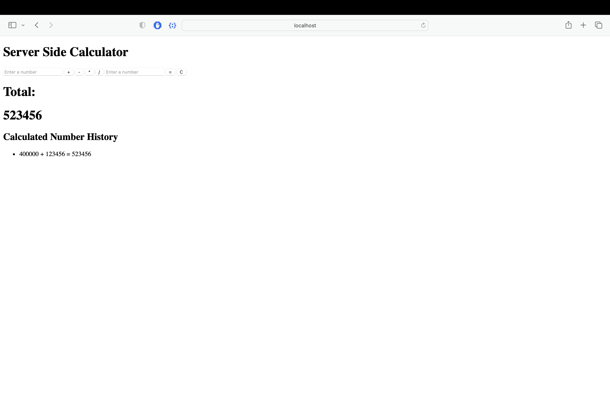

# PROJECT NAME
Weekend JQuery Server Calculator
## Description
Weekend server calculator project. Make a server side calculator with a history that keeps track of all previous entries
## Screen Shot

### Prerequisites

Link to software that is required to install the app (e.g. node).

- [Node.js](https://nodejs.org/en/)
- Everything else was installed via NPM terminal commands, I suggest you type
npm install and find out there what was used.

## Installation

1. run npm install in the terminal
2. type npm start in the terminal
3. Open up your browser of choice, preferably safari or chrome
4. type http://localhost:5000 into the browser.
5. Get calculating

## Usage
Useful for calculating things and keeping track of it, user only has ability to post if all fields are not empty. Can also clear the history via clicking a button

## Built With
Node,VSCode, Express, Body-Parser

## Acknowledgement
Thanks to [Prime Digital Academy](www.primeacademy.io) who equipped and helped me to make this application a reality. (Everybody is amazing and helpful)

## Support
If you have suggestions or issues, please email me at [zgedina@yahoo.com]